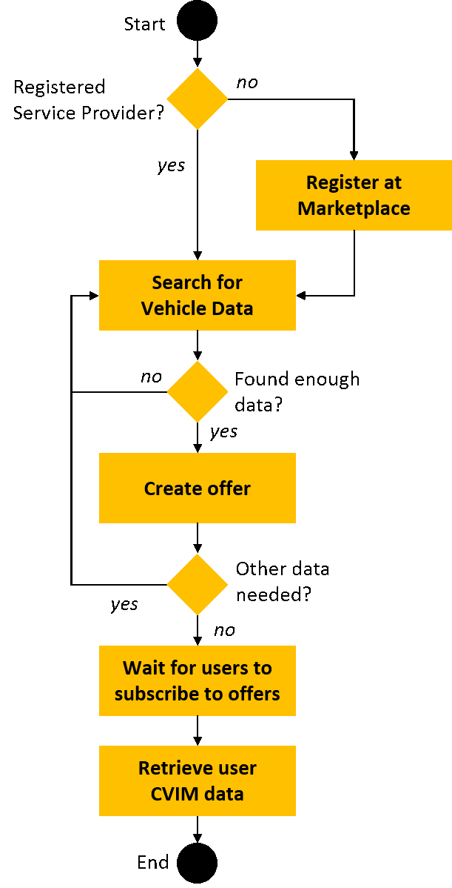

# AutoMat SDK API Library

The purpose of the API library is to lower the technical threshold of the Marketplace and CVIM usage. Service providers shall be able to easily access and communicate with the Marketplace. Therefore, the AutoMat API library has been defined and developed in accordance to the Marketplace (D4.3) and CVIM (D3.5) full prototypes. 
The figure below shows the position of the library between the Marketplace and the Service Provider. On the one side, it neatly connects to the vehicle data outputs of the Marketplace and on the other side it integrates into the Service Provider Backend. 


The SDK library consists of the following components (compare figure below):
* **Marketplace API Access**: This component manages all interaction with the REST API of the Ve-hicle Big Data Marketplace. 
* **Service Provider Backend Interaction**: This component defines the access for the Service Pro-vider Backend and has to be integrated by the Service Provider. 
* **API Data Models**: All data structures that are required for the interaction with the Marketplace API.
* **CVIM Data Model**: Implementation of CVIM vehicle big data model.


All parts of the library are publicly available together with the according documentation via the following URL:
`https://github.com/automat-project/SDK`

## API Library Installation
The API can be either downloaded and installed using the versioning control tool git  via a single zip-file download.

### Download and installation using GIT 
In order to use the API library, it has to be downloaded and installed first. The source code can be down-loaded using the versioning control tool git. The figure below shows a screenshot of the installation. Using the command-line the following command installs the library into the sub-directory SDK:
```
git clone https://github.com/automat-project/SDK.git
```


### Download and installation via ZIP file

Alternatively, all files can be downloaded in one single zip file. After the download, all files need to be unzipped into a new directory.  The SDK files can be retrieved via the following link:

```
https://raw.githubusercontent.com/automat-project/SDK/master/dist/SDK-v2.0.zip
```

## Source Code Structure

3.2	Source Code Structure
The library is written using the using [OpenAPI](https://github.com/OAI/OpenAPI-Specification/blob/master/versions/2.0.md)  and [JSON Schema](http://json-schema.org/). Those standards allow the REST API to be easily integrated in several programming languages, using existing free and open source software toolchains . The source code of the library is structured as follows
- `bin` Executeable data.
    - `swagger-codegen-cli.jar` Swagger tool for auto code generation
- `build` Output of the build process
- `dist` SDK releases
    - `SDK-v0.9.0.zip` SDK files of early prototype in one zip archive
    - `SDK-v2.0.0.zip` All SDK files of full prototype in one zip archive.
- `doc` Files used for documentation of the SDK
- `src` Source code of the library
    - `CloudStorageProvider.json` Cloud Storage Provider SDK functionalities
    - `CVIM.json` Common Vehicle Information Model objects
    - `Marketplace.json` Marketplace API definitions and objects
- `README.md` General information about SDK

## General Workflow of Marketplace Usage
The main purpose of the Marketplace is to receive data. This section aims at providing an insightful understanding, of how data can be retrieved by Service Providers from the Marketplace. It is written in a guideline style. A detailed Marketplace user interface as well as API description is provided in deliverable D4.3 Full Prototype of Vehicle Big Data Marketplace.
The Marketplace can be accessed either via the:
1. **Frontend** `https://marketplace.automat-project.eu` (Requires Registration)
2. **Backend** `https://marketplace.automat-project.eu/api` (Requires API Key)

The following shows the usage flow of the Marketplace. First, a registration at the Marketplace has to be per-formed in order to identify yourself. Without registration no access to the functionalities is granted. After the registration, the first step is the discovery of vehicle data. When enough data is available or the search matches all needs, an offer can be created. Different types of services require different types of data. Therefore, multiple offers can be created. AutoMat empowers the users to have control over their data. They need to agree that a Service Provider may have access to their data. In the next step, the Service Provider needs to wait for user’s agreements. When users are willing to share data, it can be retrieved by the service provider using the Marketplace API.

All of those steps are described in detail in the following subsections.


### Registration at Marketplace
In order to identify towards the Marketplace Service Providers need to create an account. The registration can be conducted at the following link:
```
https://marketplace.automat-project.eu/#/login`
```

Afterwards, the frontend can be accessed with the assigned username + password combination of the users account. The registration process also provides an API key, which gives access to the Marketplace API. The key needs to be included into the HTTP request header:
```
X-Auth-Token: <API-KEY>
```

### Search for Vehicle Data

The second step is the discovery of relevant data. Different queries can be performed and filters based on region, trip duration, and signals can be applied. Even though the vehicle data search can be ac-cessed both via the frontend as well as the API, the frontend is the recommended solution for unexperi-enced users. It can be accessed via the following link:
```
https://marketplace.automat-project.eu/#/pages/discovery/availability`
```

#### Query definition 
The following figure shows a screenshot of the discovery GUI. On the top, a signal filter can be ap-plied. Signals can be searched for using the input fields in the topmost line. Below on the left side, time-filters can be applied. They cover the submission date of the data as well as the start and stop of vehi-cle’s trips. The trip duration is also filterable to ensure a minimum amount of data length. On the bottom right a geographical filter can be applied. By drag-and-dropping the red box, the filter is applied. By clicking on “Query” the database is searched for available data.


#### Query results
After a query has been performed, the result is displayed below. Depending of the amount of found data, this may take some seconds. Figure 8 shows a screenshot of a query result. The result consists of a statistical overview, providing the number of possible data packages and the number of users, who collected those packages. Also a timeline, when those data packages were generated is provided. A heat map provides a rough estimate of the area, which is covered by the vehicle data discovery.
Afterwards, if the expected availability does not match the needs, the query can be refined. Otherwise, if the availability is satisfactory, an offer needs to be created. 


#### Offer Creation and User Subscription to Offer
When the service provider is satisfied with the availability of data, he can create an offer. AutoMat en-forces the concept of user empowerment. Therefore, all vehicle users need to opt-in and give their con-sent that their data is shared and accessed. The Marketplace itself does not store the vehicle data, but only caches meta-data in order to create indexes. Whenever data is requested from Service Providers, users need to agree to share their data. This is handled via the offers. The Service Provider creates the offer. Afterwards, the user can decide whether they agree to provide the data or not. 
The Service Provider can create offers directly below the results of the vehicle data discovery. Only a short description has to be provided to derive an offer from the previous search.

All created offers can be displayed under the following link:
```
https://marketplace.automat-project.eu/#/pages/store/offers`
```

The figure below shows the detailed offer view. It displayes the offer-id as well as the subscription URL, which are needed to retrieve CVIM data from the offer. Single data packages can be retrieved by clicking on the “eye” icon in the data packages section.


### Data retrieval

Data retrieval is the most crucial part of the whole AutoMat project. There are two possible methods to retrieve data: 
1.	**Pull approach:**	Data must be manually pulled by the Service Provider from the Marketplace
1.	**Push approach:**	Data is automatically pushed from the MP to the Service Provider

#### Pull approach data retrieval
The pull data leverages the Marketplace API. Therefore, an API key is required (see registration in section 3.3.1). The API supports all REST functionality. 
The basic request consists of a HTTP-GET call. The according offered has to be inserted. Additional query parameters can be applied and are described in detail in the Marketplace API description in deliverable D4.3 in section 3.1.9. 
```
GET https://automat-marketplace/api/ServiceProviderOffer/<offerid>/CvimMetadata 

Headers:
Accept: application/json
X-Auth-Token: <APIKEY>
```

The screenshot below shows the CVIM pull data request performed using the command line utility curl. All packages are saved into the file packages.json.


#### Push approach data retrieval
The push data retrieval allows the processing of CVIM data packages as soon as they are available at the Marketplace. The push approach makes use of the AEON SDK of the Fiware. The AutoMat SDK provides an example of the push data approach. 
 
## SDK Library Usage
The SDK Library can be used in several ways. The manual approach for testing and evaluating the Mar-ketplace is the graphical user interface (GUI) approach using Postman, which is described in the next section.
In order to allow easy backend integration of the AutoMat interfaces, the process of generating AutoMat client libraries in the preferred programming language of choice by leveraging the machine-readable SDK Library files is described in follow up section.

### GUI based library usage with Postman
The library can be leveraged to access the Marketplace API. Several open source and free software tools can be used in combination with the API. This example shows the manual interaction using the Postman app . It is freeware can be downloaded and easily installed on all major operating systems (Mac OS, Windows as well as Linux). A detailed tutorial on how to install and run the app can be found in the postman documentation  and is also provided in form of a video. 

#####	Library import
After Postman has been installed and started, the library has to be imported. The figure shows the process of the library import, 
1.	Click on the `import` button.
2.	Select `Choose Files`.
3.	Navigate to the directory `SDK/src`.
4.	Select the `Marketplace.json` file
5.	Click on `open`.


#### Getting started with the library
When the library is imported successfully, all available actions are displayed in the left navigation bar in a new menu `AutoMat Marketplace Interface`. In the submenus all API actions can be selected, which opens the actual request form. 

The screnshot shows Postman with the imported library and an example Vehicle Data Discovery action. On the left side, all Marketplace actions are displayed. Here, the “VehicleDataDiscovery”-item is selected, which opened the discovery request form on the top right side. Properties of the request, e.g. Authoriza-tion, Parameters are selectable. By clicking the “send” button, the Marketplace API is invoked and the Marketplace’s response shown in the bottom right.
 


#### Example Data retrieval using Postman
Postman can also be leveraged to retrieve vehicle data. This requires an already created offer. Offers can be created using the API or the frontend. Latter one is the recommended way and described in section 3.3.3 of this document.
The approach to retrieve data is very intuitive and requires only five steps:
1.	The first step is the selection of the cvimDataPackages entry in the category ServiceProviderOffer. A new Tab will open on the right side, containing the according query. 
2.	The parameters now need to be configured. By clicking on Params the configuration dialog will open.
3.	For the data retrieval at least the offer ID needs to be configured. Additional parameters can be entered, e.g. limit to only one data package. For a detailed list, please refer to the D4.3 Marketplace API description. 
4.	It needs to be ensured that the API key is entered correctly. Otherwise an `User not authenticated` error messages will be returned by the Marketplace.
5.	By clicking on the blue Send button, the request is performed. In the result dialog the CVIM Data Packages will be displayed. 
All steps are visualized in the screenshot:
 

 
### Application backend source code generation
The SDK can also be leveraged to auto generate Service Provider AutoMat API client libraries and stubs in the preferred programming language including the CVIM Data Models. The AutoMat SDK is written in the [OpenAPI format](https://www.openapis.org/). The example of this documentation makes use of the [`swagger-codegen` tool](https://github.com/swagger-api/swagger-codegen.git). The tool is delivered with the SDK and resides in the `bin` folder. In order to use to tool [Java](http://www.oracle.com/technetwork/java/javase/downloads/jre8-downloads-2133155.html) is necessary. Swagger codegen supports all major programming languages, e.g. c, C#, java, python, node, php, and many more. This allows easy integration of the AutoMat API into existing software.

#### Automatic code generation for AutoMat Marketplace clients
The swagger-codegen, which is used to automatically generate AutoMat Marketplace clients, is served within the SDK library. For the retrieval and installation of the SDK please review section above. The swagger-codegen can be run using a standard Java interpreter, e.g. from the root of the SDK folder, the following command displays the help text of the tool:
```
java –jar bin/swagger-codegen-cli-2.2.3.jar help
```

The following command runs the code generation: 
```
java –jar bin/swagger-codegen-cli-2.2.3.jar generate 
	–i src/Marketplace.json
	-o <output directory>
	-l <programming_language>
```

The swagger supports all major programming languages. Within the scope of this example, the programming language python is used. The following command in the figure below shows how the codegen is used to use the SDK library to create a new api_client_python project, which contains all necessary code to operate with the Automat system. 


The result of the automatic code generation is displayed in following screenshot. It consist of the actual api_client, a configuration file, and some supporting, python specific files, which perform the actual AutoMat REST API calls. 
 

####	Data retrieval using example auto generated client
Once the source code has been generated, working with the API becomes straightforward. Only four lines of code are necessary, to retrieve data. Data retrieval requires an offer ID. 
The following example script is able to retrieve data using the auto generated source code:


First the library is imported. The `X-Auth-Token` for the HTTP Header needs to be set in order to authenti-cate the client to the Marketplace. Afterwards, the client can be initiated. The data retrieval is now only one single function call. It takes as input the offer id and also supports additional parameters, such as limiting or filtering. The following Figure 17 shows the result of the example service. One CVIM Data Package is retrieved from the AutoMat Marketplace. 
 


- [1] https://git-scm.com/
- [2] OpenAPI Specification (fka Swagger RESTful API documentation specification), 08.09.2014, https://github.com/OAI/OpenAPI-Specification/blob/master/versions/2.0.md
- [3] JSON Schema, “Core definitions and terminology”, Version 4.0, 31.01.2013, https://tools.ietf.org/html/draft-zyp-json-schema-04, see also http://json-schema.org/ 
- [4] Tools, libraries and frameworks for the integration OpenAPI interfaces, http://swagger.io/open-source-integrations/
- [5] AEON SDK, https://gitlab.atosresearch.eu/ari/aeon-sdk.git
- [6] Postman, https://www.getpostman.com/postman
- [7] Swagger-Codegen, https://github.com/swagger-api/swagger-codegen.git
